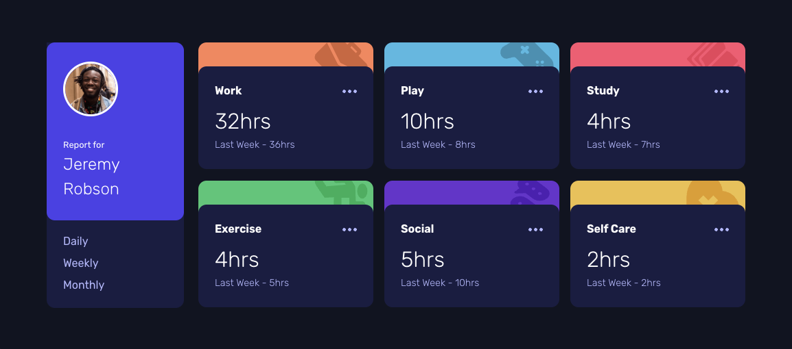

# Frontend Mentor - Time tracking dashboard solution

This is a solution to the [Time tracking dashboard challenge on Frontend Mentor](https://www.frontendmentor.io/challenges/time-tracking-dashboard-UIQ7167Jw). Frontend Mentor challenges help you improve your coding skills by building realistic projects.

## Table of contents

- [Overview](#overview)
  - [The challenge](#the-challenge)
  - [Screenshot](#screenshot)
  - [Links](#links)
- [My process](#my-process)
  - [Built with](#built-with)
  - [What I learned](#what-i-learned)
  - [Continued development](#continued-development)
  - [Useful resources](#useful-resources)
- [Author](#author)

## Overview

### The challenge

Users should be able to:

- View the optimal layout for the site depending on their device's screen size
- See hover states for all interactive elements on the page
- Switch between viewing Daily, Weekly, and Monthly stats

### Screenshot



### Links

- [Solution URL](https://github.com/codercreative/time-tracking-dashboard)
- [Live Site URL](https://time-tracking-dashboard-chris.netlify.app/)

## My process

### Built with

- Semantic HTML5 markup
- CSS custom properties
- Flexbox
- CSS Grid
- Mobile-first workflow

### What I learned

Centering the container in the middle of the browser window:

```css
body {
  display: flex;
  justify-content: center;
  align-items: center;
  min-height: 100vh;
}
```

User overflow hidden to make sure that the top of the activity icons are cut off:

```css
.icon-card {
  display: flex;
  justify-content: flex-end;
  overflow: hidden;
}
```

Stacking the info-cards on top of the colored backgrounds:

```css
.card-wrapper {
  position: relative; /*relative here */
  margin-bottom: 30px;
}

.icon-card {
  display: flex;
  justify-content: flex-end;
  overflow: hidden;
  height: 160px;
  z-index: 1; /*insert z-index */
}

.info-card {
  background-color: var(--dark-blue);
  height: 160px;
  width: 78px;
  position: absolute; /*absolute here */
  top: 30px; /*make colored top show in the bg */
  z-index: 2; /*insert z-index */
}
```

I used `activity.title` from the JSON file to match and manipulate corresponding HTML elements. By converting titles to lowercase and using them as class names, I efficiently targeted and updated the specific cards in the DOM based on the selected timeframe.

Also, in the `updateTimeDisplay` function, I used destructuring assignment to simplify the extraction of current and previous time values from the `activity.timeframes[selectedTimeframe]` JSON object.

`activity.timeframes[selectedTimeframe]` accesses the specific timeframe data (e.g., daily, weekly, monthly) for the current activity from the JSON object.
{ current, previous } extracts the current and previous values from this data.

### Continued development

Next, I could refactor the code by removing the hard-coded cards from the HTML file by using template literals in JavaScript to dynamically generate and insert each card. This approach will make the code more modular and easier to maintain.

### Useful resources

- [CSS Grid Cheat Sheet](https://htmlcheatsheet.com/css/)

## Author

- Frontend Mentor - [@codercreative](https://www.frontendmentor.io/profile/codercreative)
